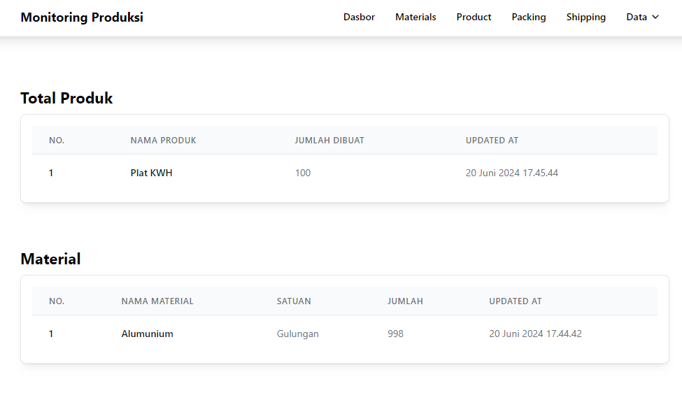
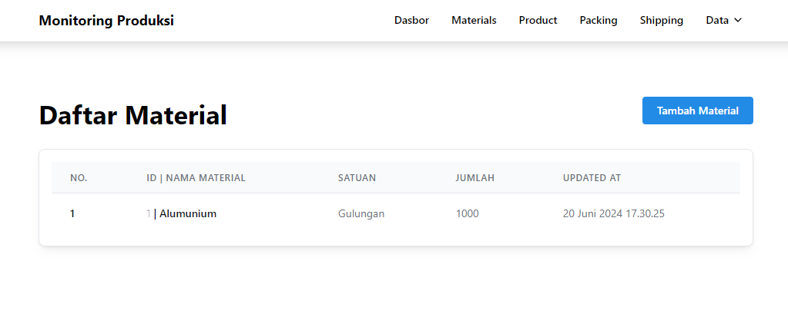
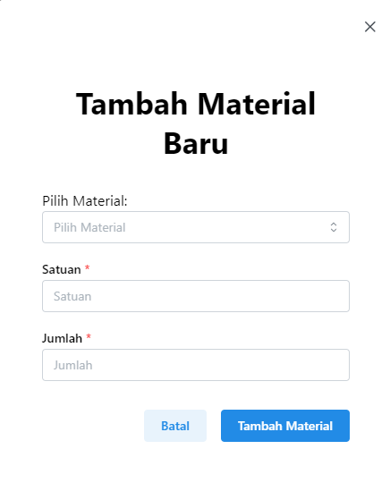
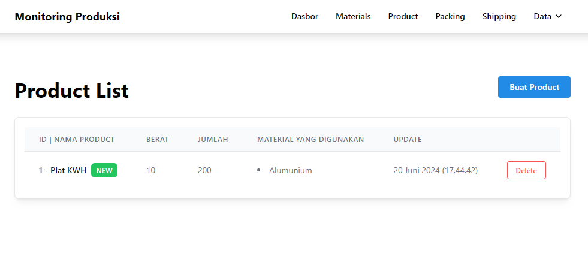
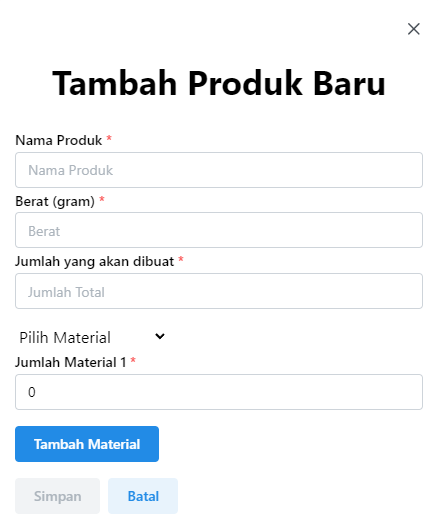
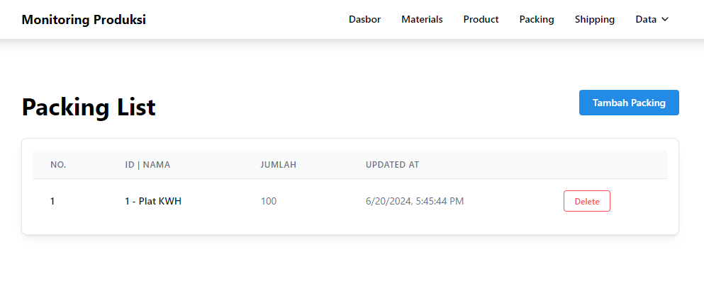
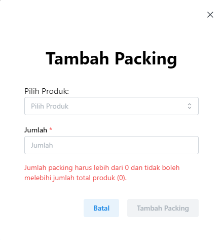
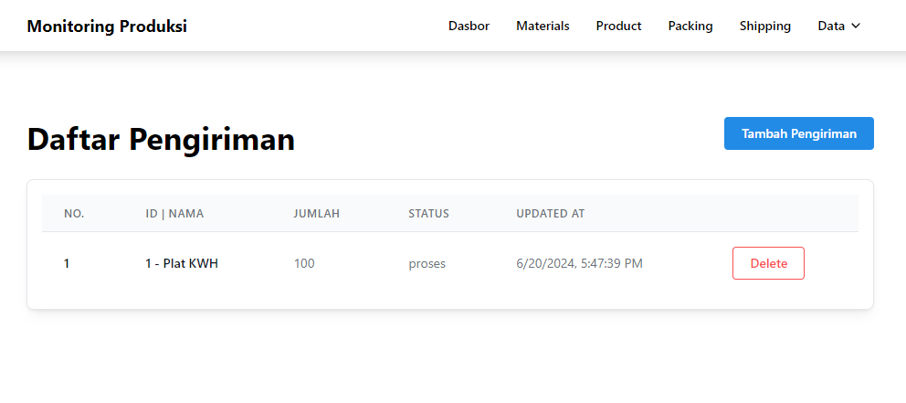
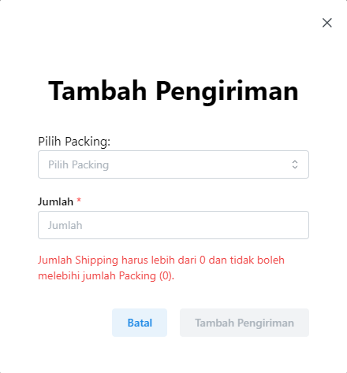

  
  <h2 align="center" style="font-size: 32px; color: #1F2937; margin-top: 20px;"><strong>MONITORING PRODUKSI</strong></h2>

## 📖 Introduction

**Monitoring Produksi** adalah aplikasi sederhana yang digunakan untuk mengatur dan memantau produksi dengan lebih efektif.

## 🛠️ Technologies Used:

- **Next.js** - Server-side rendering and React framework
- **Sequelize** - ORM for handling database operations
- **Express** - Backend framework for building APIs
- **Tailwind CSS** - Utility-first CSS framework for styling
- **MySQL** - Relational database management system

 

## 🖼️ Screenshots

### 🖥️ Dasbor

  

### 🗂️ Materials Page

  
  

### 🛒 Produk Page

  
  

### 📦 Packing Page

  
  

### 🚚 Shipping Page

  
  

