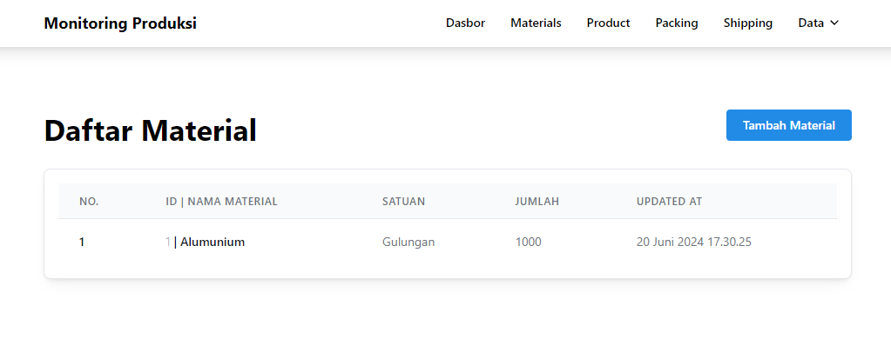
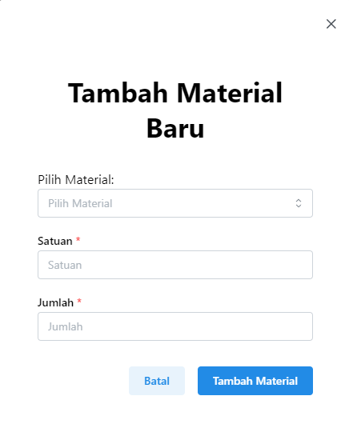
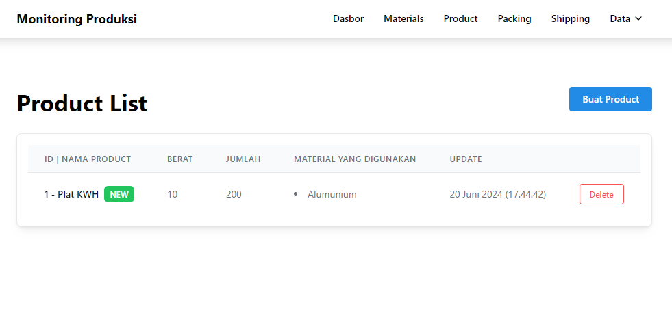
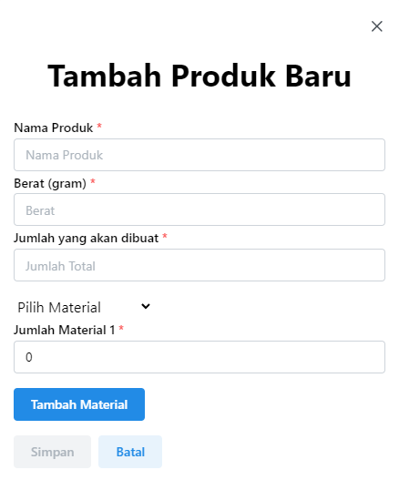
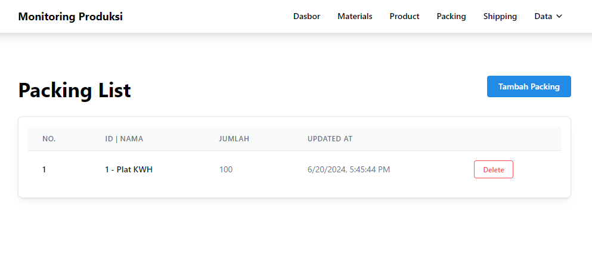
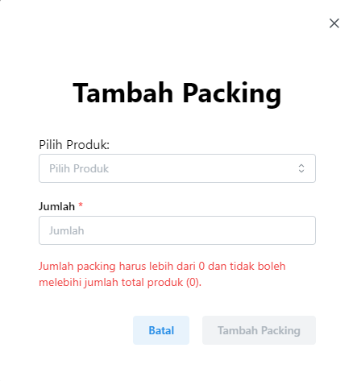
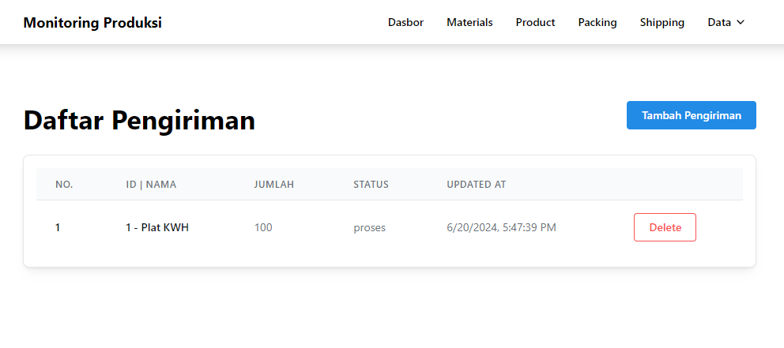
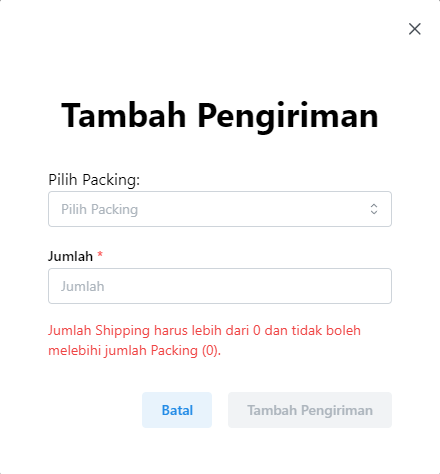

  <!--  -->
  <h2 align="center" style="font-size:30px;"><strong>MONITORING PRODUKSI</strong></h2>

## Technologies Used:

- Next.js 14

 

## Screenshots

### Dasbor

  

### Materials Page

  

### Produk Page

  

### Packing Page

  

### Shipping Page

  

